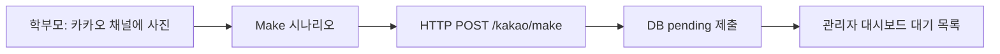

# 예진샘 (YejinSaem) — 글쓰기 피드백 자동화

카카오 채널(또는 Make.com)로 학부모가 보낸 워크시트 사진을 받아, Claude로 피드백 초안을 생성하고 관리자가 검토·전송하는 서비스입니다.

---

## 로컬 실행

### 1. 환경 설정

```bash
cd backend
cp .env.example .env
```

`backend/.env` 필수 항목:

```env
ANTHROPIC_API_KEY=sk-ant-api03-...   # https://console.anthropic.com
```

피드백을 카카오로 **자동 전송**할 때만 솔라피(`SOLAPI_*`) 키를 추가합니다. 로컬에서 복사·붙여넣기만 할 때는 생략 가능합니다.

### 2. 의존성 설치 및 서버 실행

```bash
cd backend
pip install -r requirements.txt
python3 -m uvicorn main:app --host 0.0.0.0 --port 8000 --reload
```

- 관리자 대시보드: http://localhost:8000  
- API 문서: http://localhost:8000/docs  
- API 키 상태 확인: http://localhost:8000/admin/config-status  

`.env` 수정 후에는 서버를 **완전히 재시작**(Ctrl+C 후 다시 실행)해야 반영됩니다.

---

## 로컬 아날로그 운영 (배포 전)

카톡으로 받은 사진을 직접 처리할 때 권장 흐름입니다.

1. **학부모 관리** → 아이 등록 (이름, 레벨, 필요 시 전화번호)
2. **대기 목록** → **새 제출 (로컬용)**
   - 학부모 선택
   - **파일 선택** 또는 **Ctrl+V**(⌘V)로 클립보드 이미지 붙여넣기
   - **사진 업로드**
3. 제출 클릭 → 레벨·단계 선택 → **피드백 생성**
4. 텍스트 수정 → **복사하기** → 카카오에 붙여넣기  
   (자동 발송은 **카카오 전송** 버튼, 솔라피 설정 필요)

대기 목록은 **새로고침** 또는 약 **60초**마다 자동 갱신됩니다 (실시간 푸시 아님).

---

## 카카오 사진 → 대기 목록 자동 등록

### 동작 요약

연동이 완료되면:

1. 학부모가 카카오 채널로 사진 전송  
2. Make 시나리오(또는 오픈빌더)가 서버로 HTTP POST  
3. 서버가 이미지 저장 + `Submission` (`status=pending`) 생성  
4. 관리자 **대기 목록**에 표시 (`sent` 제외한 모든 제출)

### 전체 구조 (Make 권장)

```
학부모(카카오) → Make 시나리오 → POST /kakao/make → DB pending → 관리자 대시보드
```



### 사전 준비

| 항목 | 설명 |
|------|------|
| 서버 공개 URL | ngrok, Cloudflare Tunnel, 배포 URL 등 (`https://...`) |
| 학부모 등록 | 대시보드 **카카오 사용자 ID** = Make에서 보낼 `kakao_user_id`와 동일 |
| 이미지 URL | 서버가 **다운로드 가능한 공개 URL**이어야 함 (만료·비공개 URL 불가) |

선택: `backend/.env`에 보안용 시크릿

```env
MAKE_WEBHOOK_SECRET=임의의_긴_문자열
```

Make HTTP 모듈 헤더: `X-Make-Secret: <위와 동일>`

---

## Make.com 시나리오 설정

Make 유료로 시나리오를 만들 때 **`POST /kakao/make`** 를 사용하는 것을 권장합니다. (오픈빌더 JSON보다 매핑이 단순합니다.)

### 모듈 1 — 트리거

카카오/채널 연동 방식에 맞게 선택:

- 카카오·채널 관련 Make 모듈 (메시지·이미지 수신)
- 또는 중간 웹훅 → **Make Custom Webhook** 트리거

다음 값을 확보합니다:

- `kakao_user_id` — 채널 사용자 ID  
- `image_url` — 사진 **공개 다운로드 URL**

### 모듈 2 — HTTP → 예진샘

| 설정 | 값 |
|------|-----|
| URL | `https://<공개도메인>/kakao/make` |
| Method | POST |
| Body type | JSON |

**Body 예시** (Make 필드명에 맞게 매핑):

```json
{
  "kakao_user_id": "{{트리거.user_id}}",
  "image_url": "{{트리거.image_url}}",
  "message": "{{트리거.text}}"
}
```

**Headers (선택):**

```
X-Make-Secret: <MAKE_WEBHOOK_SECRET>
```

### 모듈 3 (선택) — 학부모 답장

HTTP 응답 `ok: true`일 때 카카오로 안내 메시지 전송  
예: 「사진을 받았어요! 선생님이 곧 피드백을 드릴게요」

### 성공 응답 예시

```json
{
  "ok": true,
  "submission_id": 2,
  "status": "pending",
  "child_name": "민준",
  "message": "대기 목록에 추가되었습니다."
}
```

이후 대시보드 **대기 목록**에서 **새로고침**합니다.

### Make 연동 오류

| 응답 / 증상 | 원인 · 조치 |
|-------------|-------------|
| `등록되지 않은 카카오 사용자` | 학부모 미등록 또는 `kakao_user_id` 불일치 → 대시보드에서 등록·ID 확인 |
| `이미지를 다운로드하지 못했습니다` | URL 비공개·만료 → Make에서 공개 URL로 변환 |
| Connection refused | 서버/ngrok 중단, URL 오타 |
| 대기 목록에 안 보임 | 새로고침, `config-status`·서버 로그 확인 |

---

## 오픈빌더 직연결 (선택)

| 방식 | 엔드포인트 | 비고 |
|------|------------|------|
| **Make (권장)** | `POST /kakao/make` | 단순 JSON |
| 오픈빌더 | `POST /kakao/webhook` | 카카오 응답 스키마 필요, 블록 설정 의존 |

오픈빌더 URL: `https://<공개도메인>/kakao/webhook`  
미등록 학부모는 안내 메시지 후 제출을 만들지 않습니다.

---

## API 요약

| Method | Path | 용도 |
|--------|------|------|
| GET | `/admin/config-status` | Anthropic API 키 설정 상태 (키 값 미노출) |
| GET | `/admin/submissions` | 제출 목록 |
| POST | `/admin/submissions/upload?parent_id=` | 관리자 직접 사진 업로드 |
| POST | `/admin/submissions/{id}/generate` | Claude 피드백 생성 |
| PUT | `/admin/submissions/{id}/approve` | 승인 후 솔라피 친구톡 전송 |
| POST | `/kakao/make` | Make.com → 대기 목록 등록 |
| POST | `/kakao/webhook` | 카카오 i 오픈빌더 웹훅 |

---

## 환경 변수 (`backend/.env`)

| 변수 | 필수 | 설명 |
|------|------|------|
| `ANTHROPIC_API_KEY` | ✅ | `sk-ant-` 로 시작하는 Claude API 키 |
| `SOLAPI_API_KEY` / `SECRET` / `SENDER_*` | 친구톡 발송 시 | 솔라피 친구톡 |
| `MAKE_WEBHOOK_SECRET` | 선택 | Make → `/kakao/make` 헤더 검증 |
| `KAKAO_CHANNEL_SECRET` | 선택 | 오픈빌더 (검증 로직 확장 예정) |
| `UPLOAD_DIR` | 선택 | 기본 `./uploads` |
| `DATABASE_URL` | 선택 | 기본 SQLite `sqlite:///./yejinsaem.db` |

---

## 피드백 생성 오류

| 메시지 | 조치 |
|--------|------|
| API 키가 유효하지 않습니다 | `backend/.env`에 실제 `sk-ant-...` 입력 후 서버 재시작 |
| `looks_valid: false` (config-status) | 예시 값 `your_anthropic_key_here` 제거 |
| 401 / invalid x-api-key | 키 재발급, 따옴표·공백 제거, 결제·크레딧 확인 |

---

## 기술 스택

- Backend: FastAPI, SQLAlchemy, SQLite  
- AI: Anthropic Claude (Vision)  
- 메시징: 솔라피 친구톡, 카카오 i 오픈빌더 / Make.com  
- Frontend: 단일 HTML 관리자 대시보드  

---

## 브랜치

기능 개발: `cursor/prompt-v2-local-upload-c8ae`  
기본: `claude/automate-kakao-feedback-Hxvpr`
