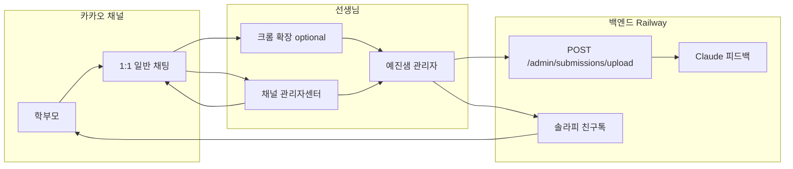

# 카카오 채널 수동 수신 + 관리자 직접 제출 기획

> **요약**: 학부모 사진은 **채널 1:1 일반 채팅**으로 받고, 선생님은 톡방에서 답장한다. 첨삭·발송 워크플로는 **관리자 페이지**에서 처리하며, 톡방 → 관리자 전송은 **직접 업로드(붙여넣기)** 또는 **크롬 확장 프로그램**으로 한다.
>
> **프로젝트**: YejinSaem (예진샘)  
> **버전**: 1.0  
> **작성일**: 2026-05-22  
> **상태**: 확정(기획 변경)

---

## 1. 변경 배경

### 1.1 기존 방식의 한계

| 항목 | 오픈빌더 + 이미지 보안전송(secureimage) |
|------|----------------------------------------|
| 채널 1:1 톡방 | 사진·대화가 **남지 않는 경우가 많음** |
| 선생님 답장 | 톡방에서 **직접 답장 불가**에 가까움 |
| 사용자 식별 | `botUserKey`만으로는 **실명·전화번호 특정 불가** |
| 자동 수집 | 스킬 서버로만 이미지 URL 수신 가능 |

### 1.2 검토했으나 채택하지 않은 대안

| 대안 | 미채택 사유 |
|------|-------------|
| **상담톡 + 메시지 수신 API** | 별도 계약·딜러 도입, 채널 관리자센터 1:1 비활성화, 개발·운영 비용 큼 |
| **채팅에서 전화번호/식별코드 수집** | 학부모 UX 부담, 개인정보 채팅 노출 우려 |
| **botUserKey만으로 친구톡 발송** | 솔라피 친구톡은 **전화번호 필수**, ID만으로 발송 불가 |

### 1.3 변경 결론

- **수신**: 카카오 **일반 1:1 채팅**(채널 관리자센터에서 상담)
- **첨삭·기록**: 예진샘 **관리자 페이지** (`frontend/index.html`)
- **톡방 → 관리자**: 선생님이 **의도적으로** 이미지를 넘김 (붙여넣기 또는 크롬 확장)
- **발송**: 기존과 동일 — 솔라피 **친구톡(전화번호)** 또는 톡방 **직접 답장** + 관리자 **「직접 전송 완료」**

---

## 2. 목표 사용자 흐름

### 2.1 학부모

1. 카카오톡 채널 **1:1 채팅**을 연다.
2. **채팅창에 사진을 직접** 보낸다. (챗봇 「사진 보내기」/ secureimage 버튼 사용 안 함)
3. 필요 시 선생님과 **같은 톡방**에서 문의·추가 사진을 주고받는다.

### 2.2 선생님 (일상)

1. **채널 관리자센터**에서 해당 학부모 **1:1 톡방**을 연다. (대화·사진이 톡방에 남음)
2. 톡방에서 **답장·안내**를 한다.
3. 첨삭이 필요한 사진을 **관리자 페이지로 전송**한다.
   - **1단계(즉시 가능)**: 이미지 복사 → 관리자 「직접 제출 만들기」에 붙여넣기
   - **2단계(도구)**: 크롬 확장 **「예진샘으로 보내기」** 버튼 1회
4. 관리자에서 **학부모 선택** → AI 피드백 생성 → 검수
5. 피드백 전달:
   - **친구톡**: 학부모에 **전화번호가 등록된 경우**만 솔라피 발송
   - **톡방 직접 전송**: 복사 후 1:1 채팅에 붙여넣기 → 관리자 **「직접 전송 완료」**

### 2.3 선생님 (사전 등록)

| 시점 | 작업 |
|------|------|
| 주문·엑셀 확보 시 | 관리자 **학부모 관리**에 **전화번호 + 내부 관리명**(아이 이름 등) 등록 |
| 첫 상담 후 | 동일 학부모 행 유지 (채널 닉네임과 관리명은 수동으로 대응) |

`botUserKey`(카카오 채널 연결 ID) 자동 수집은 **필수가 아님**. 친구톡·식별의 기준은 **전화번호 + 관리자에서 지정한 학부모**.

---

## 3. 시스템 구성 (변경 후)

### 3.1 유지하는 기능

| 기능 | 경로·비고 |
|------|-----------|
| 관리자 직접 제출 | `POST /admin/submissions/upload?parent_id=` |
| 피드백 생성·승인·발송 | 기존 `/admin/submissions/*` |
| 친구톡 발송 | `services/kakao_service.py` (전화번호) |
| 직접 전송 완료 | `POST /admin/submissions/{id}/mark-sent` |
| 개인정보 노출 방지 | 채널·친구톡 문구에서 아이/학부모 실명 미포함 |

### 3.2 축소·중단하는 기능

| 기능 | 처리 |
|------|------|
| 오픈빌더 **secureimage** 사진 수신 | **운영 중단** — 시나리오에서 이미지 블록 제거 또는 비활성 |
| 미등록 사용자 **채널 미등록** 자동 제출 | **점진적 미사용** (웹훅 유지해도 실제 유입 경로 아님) |
| 채팅 내 전화번호·botUserKey 요청 | **하지 않음** |

### 3.3 선택적 유지 (낮은 우선순위)

| 기능 | 비고 |
|------|------|
| `POST /kakao/webhook` | 웰컴 문구·안내만 남길 경우 유지 가능. 사진 처리 블록은 끔 |
| `botUserKey` 필드 | 관리자에 필드는 두되, **수동 입력·로그 참고용** |

---

## 4. 카카오 채널·챗봇 설정 (운영 가이드)

### 4.1 권장 설정

| 항목 | 설정 |
|------|------|
| 1:1 채팅 | **사용** (채널 관리자센터에서 상담) |
| 채팅방 메뉴 vs 챗봇 | **1:1 상담 우선** — 이미지는 일반 채팅으로만 받기 |
| 오픈빌더 이미지 블록 | **제거** 또는 「채팅창에 사진을 직접 보내 주세요」 안내만 |
| secureimage 플러그인 | **사용 안 함** |

### 4.2 학부모 안내 문구 (예시)

> 생글방글 예진샘입니다.  
> 첨삭 받을 사진은 **이 채팅창에 그대로** 보내 주세요.  
> 선생님이 확인 후 답변드립니다.

(챗봇이 켜져 있다면 폴백·웰컴에도 동일 메시지 유도.)

### 4.3 관련 문서

- 기존 오픈빌더 트러블슈팅: `docs/openbuilder-fix.md` → **레거시 참고**로 간주, 신규 운영은 본 문서 기준

---

## 5. 관리자 페이지 (현재·추가)

### 5.1 이미 구현됨

- **직접 제출 만들기**: 학부모 선택, 파일 선택, **클립보드 붙여넣기**, 제출 생성
- API: `POST /admin/submissions/upload` (Bearer `ADMIN_PASSWORD`)

### 5.2 기획상 추가 (UI·문서)

| 항목 | 설명 |
|------|------|
| 운영 안내 카드 | 「카카오 톡방 → 붙여넣기 또는 확장 프로그램」 절차 3줄 요약 |
| 학부모 검색 | 직접 제출 시 이름·전화 뒷자리로 빠른 선택 (선택 과제) |

---

## 6. 크롬 확장 프로그램 (2단계)

### 6.1 목적

채널 관리자센터(`center-pf.kakao.com`) 1:1 화면에서 **버튼 한 번**으로 현재 대화의 이미지를 예진샘 관리자 API로 업로드한다.

### 6.2 MVP 범위

| 포함 | 제외 |
|------|------|
| 최근(또는 선택) **이미지 1~N장** 추출·업로드 | botUserKey 자동 추출·매칭 |
| 팝업에서 **학부모 선택** + 최근 사용 기억 | 카카오 답장 자동 전송 |
| 설정: API URL, 관리자 비밀번호 | 다중 선생님 계정 |

### 6.3 기술 요약

- **Manifest V3**, content script on `center-pf.kakao.com`
- `fetch` + 세션 쿠키로 이미지 바이너리 확보 후 `multipart/form-data` 업로드
- `Authorization: Bearer {ADMIN_PASSWORD}`
- 성공 시 제출 ID 표시 또는 관리자 페이지 새 탭

### 6.4 리스크

- 카카오 관리자 UI 변경 시 **DOM 선택자 수정** 필요
- 이미지 CDN이 쿠키 의존일 경우 background script에서 재다운로드 필요

---

## 7. 식별·발송 규칙 (재확인)

| 질문 | 답 |
|------|-----|
| botUserKey만 알면 메시지 보낼 수 있나? | **아니오** — 친구톡은 전화번호 필요 |
| botUserKey만으로 누구인지 알 수 있나? | **아니오** — 관리자에서 학부모 **수동 선택** |
| 톡방에 사진이 남나? | **예** — 일반 1:1 채팅 사용 시 |
| 전화번호 없을 때 피드백은? | 톡방 **직접 전송** + **직접 전송 완료** 처리 |

---

## 8. 범위 (In / Out)

### 8.1 In Scope (본 기획)

- [ ] 카카오 채널·챗봇 운영 설정 변경 (일반 채팅 수신, secureimage 중단)
- [ ] 관리자 UI에 수동 수신 운영 안내
- [ ] 크롬 확장 MVP (선택 일정, 2단계)
- [ ] 기존 직접 업로드·친구톡·직접 전송 완료 플로우 유지·문서화

### 8.2 Out of Scope

- 상담톡·카카오 메시지 수신 API 연동
- 오픈빌더 기반 자동 사진 수집 고도화
- 학부모 카카오 ID·전화번호 채팅 수집
- 다중 관리자·RBAC

---

## 9. 이전 기획과의 관계

| 문서 | 관계 |
|------|------|
| `docs/01-plan/features/remaining-feature-development.plan.md` | 인프라·안정화 항목은 유효. **카카오 자동 웹훅 수신** 중심 FR은 본 문서로 **대체** |
| `docs/02-design/features/remaining-feature-development.design.md` | Kakao webhook 중심 설계는 **레거시** — 수동 수신 기준으로 추후 design 갱신 권장 |
| `docs/openbuilder-fix.md` | 오픈빌더 스킬·secureimage 설정 — **참고용** |

---

## 10. 롤아웃 체크리스트

### 즉시 (코드 배포 없이)

- [ ] 오픈빌더에서 **이미지 보안전송 블록** 비활성 또는 삭제
- [ ] 학부모 안내: **채팅창에 사진 직접 전송**
- [ ] 채널 **1:1 채팅** 사용 확인
- [ ] 관리자 **학부모 전화번호** 사전 등록 루틴 정리

### 단기 (관리자·문서)

- [ ] 관리자 화면 「직접 제출」 사용법 안내 문구
- [ ] 본 기획서 팀 공유

### 중기 (도구)

- [ ] 크롬 확장 MVP 개발·내부 테스트
- [ ] (선택) `/kakao/webhook` 응답을 안내 문구만 남기도록 단순화

---

## 11. 성공 기준

1. 학부모 사진이 **채널 1:1 톡방에 보인다**.
2. 선생님이 **같은 톡방에서 답장**할 수 있다.
3. 첨삭용 사진이 **관리자 피드백 대기**에 1분 이내 수동·확장으로 들어간다.
4. 전화번호 등록 학부모는 **친구톡**으로, 미등록은 **톡방 직접 + 직접 전송 완료**로 마감할 수 있다.

---

## 변경 이력

| 날짜 | 버전 | 내용 |
|------|------|------|
| 2026-05-22 | 1.0 | 오픈빌더 자동 수신 → 1:1 일반 채팅 + 관리자 직접 제출·크롬 확장 기획 확정 |
